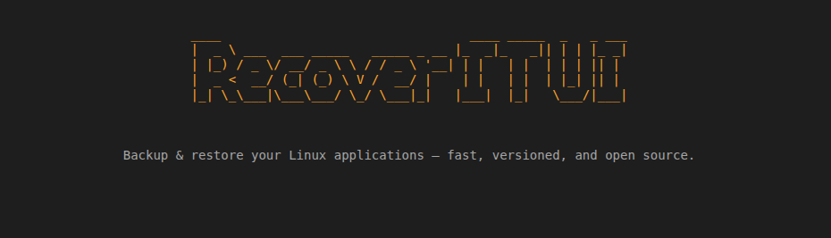

# Documentation Recovery TUI

Cette documentation a été créée pour rendre l’utilisation du logiciel Recovery TUI plus simple, plus claire et plus accessible à tous.

## Pourquoi cette documentation est importante

Créer une documentation de qualité est essentiel pour :

- faciliter la prise en main du logiciel par les nouveaux utilisateurs ;
- expliquer clairement les fonctionnalités et les usages principaux ;
- réduire les erreurs et les questions répétitives ;
- aider à la maintenance et à la continuité du projet ;
- permettre une meilleure collaboration entre les membres de l’équipe.

Une bonne documentation ne sert pas seulement à “expliquer”, elle permet aussi de valoriser le logiciel, de gagner du temps et d’améliorer l’expérience utilisateur.

## Documentation en ligne

Vous pouvez consulter la documentation complète ici :

https://misamu12.github.io/Doc_recovery-tui/

## Objectif de ce projet

Ce dépôt a pour but de centraliser les informations utiles sur Recovery TUI afin de fournir une reference claire, structurée et facilement consultable.

## Utilisation

1. Ouvrez la documentation en ligne.
2. Parcourez les sections principales.
3. Utilisez les explications fournies pour mieux comprendre le logiciel et l’utiliser efficacement.

---

Si vous souhaitez contribuer ou améliorer cette documentation, n’hésitez pas à proposer des modifications ou à enrichir les contenus existants.
